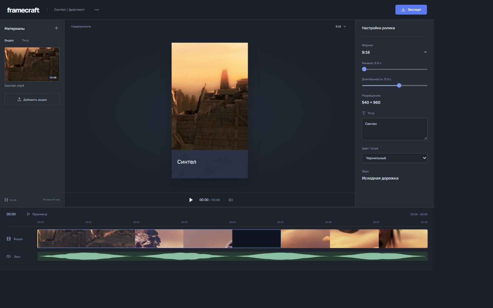

# Framecraft

Редактор коротких вертикальных роликов. Позволяет выбрать фрагмент видео, добавить титр, посмотреть результат и скачать готовый MP4 со звуком.

[](https://github.com/famelikolbut5/framecraft/actions/workflows/ci.yml)



## Возможности

- Загрузка собственного видео и выбор начала и длины фрагмента.
- Предпросмотр с титром и временной шкалой.
- Кадрирование 9:16 и два оформления титра.
- Экспорт через FFmpeg с прогрессом и скачиванием MP4.

## Как устроен проект

Обработка видео выполняется на сервере. Интерфейс получает прогресс FFmpeg и показывает готовый файл после завершения. Кадры на временной шкале и звуковая волна строятся из исходного видео.

**Стек:** Python, FastAPI, FFmpeg, PyAV, React, TypeScript, Vite.

## Структура

```text
backend/        загрузка файлов, контроль одной активной задачи и экспорт MP4
src/            интерфейс, состояния и работа с API
public/         видеофрагмент для работы редактора
tests/          проверки поведения серверной части
docs/           запуск, проверки и материалы проекта
Dockerfile      сборка интерфейса и серверного приложения
compose.yml     локальный запуск с сохранением данных
```

## Запуск

Нужны Git и Docker. Каждый проект запускается отдельно на порту 8000.

```sh
git clone https://github.com/famelikolbut5/framecraft.git
cd framecraft
docker compose up --build
```

В комплекте есть фрагмент «Синтел» (Blender Foundation, CC BY 3.0); [авторство и изменения](THIRD_PARTY.md#видеофрагмент).

Откройте [localhost:8000](http://localhost:8000). [Запуск без Docker и настройки](docs/RUNNING.md).

## Состав демоверсии

Экспорт: 540 × 960, центральное кадрирование и один титр. Одна активная задача рендера; история задач хранится в памяти сервера.

[Проверки и результаты](docs/VALIDATION.md) | [Лицензии зависимостей и материалов](THIRD_PARTY.md) | [MIT](LICENSE)
